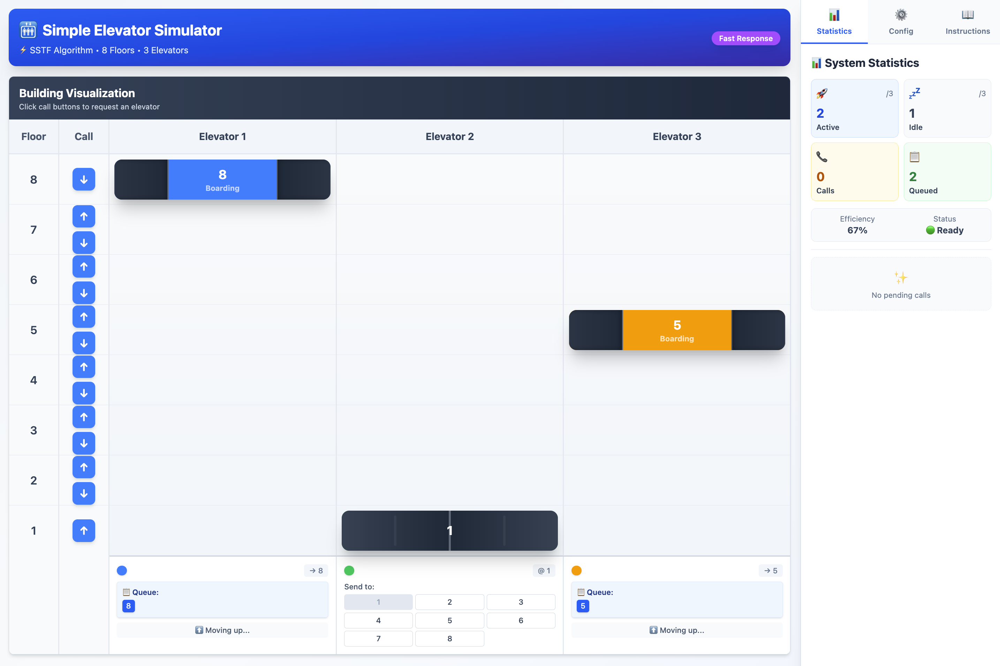

# 🏢 Simple Elevator Simulator

An interactive elevator scheduling simulator that visualizes and compares different elevator dispatch algorithms in real-time. Built for educational purposes, algorithm analysis, and human-computer interaction studies.



## 📋 Overview

This interactive web application simulates a multi-elevator system in a building with configurable floors and elevators. Users can test and compare different scheduling algorithms to understand their behavior, efficiency, and trade-offs in various scenarios. The simulator features realistic elevator mechanics including door animations, detailed operational states, and smooth floor-by-floor movement.

## ✨ Features

### Core Functionality
- **Configurable Building**: Set 2-24 floors and 2-12 elevators with real-time reconfiguration
- **Real-time Visualization**: Watch elevators move floor-by-floor with smooth animations
- **Realistic Mechanics**: 
  - Door opening/closing animations with progress indicators
  - Detailed operational states (IDLE, MOVING, DOORS_OPENING, DOORS_OPEN, DOORS_CLOSING)
  - Configurable timing for travel and door operations
- **Multiple Operating Modes**:
  - **Manual Mode**: Manually assign calls to specific elevators with full control
  - **Automatic Mode**: Algorithms automatically optimize elevator assignments
- **Interactive UI**:
  - Collapsible sidebars for optimal screen space
  - Tabbed control panels for organized information
  - Real-time statistics dashboard
  - Call buttons on each floor (up/down directions)
  - Direct floor selection for elevators

### Scheduling Algorithms

#### 1. **LOOK Algorithm** (Recommended)
- Elevators move in one direction, serving all requests in that direction
- Reverses direction only when no more requests exist ahead
- Optimal for overall system efficiency
- Similar to real-world elevator systems

#### 2. **SSTF (Shortest Seek Time First)**
- Always serves the nearest floor next, regardless of direction
- Minimizes immediate travel distance
- Fast response for nearby calls
- May cause starvation for distant floors

### User Interface Components
- **Building Visualization**: 
  - Visual representation of the building with floor indicators
  - Interactive call buttons for each floor (up/down)
  - Animated elevator cars showing current position and state
  - Color-coded elevator indicators
- **Statistics Dashboard**: 
  - Active/idle elevator count
  - Pending calls tracking
  - Queue length monitoring
- **Right Sidebar**:
  - Algorithm and building configuration panel
  - Collapsible sections for better space management
  - Instructions panel with contextual help
- **Calls & Elevators Panel**:
  - Real-time queue display for each elevator
  - Elevator status monitoring (floor, direction, state)
  - Pending calls list with manual assignment controls
  - Direct elevator control buttons

## 🚀 Getting Started

### Prerequisites
- Node.js (v20.0.0 or higher)
- npm (v10.0.0 or higher)

### Installation

1. Clone the repository:
```bash
git clone https://github.com/phatpham9/simple-elevator-simulator.git
cd simple-elevator-simulator
```

2. Install dependencies:
```bash
npm install
```

3. Start the development server:
```bash
npm run dev
```

4. Open your browser and navigate to the URL shown in the terminal (typically `http://localhost:5173`)

## 🎮 How to Use

### Manual Mode
1. Click the up/down buttons next to any floor to request an elevator
2. Pending calls appear in the Control Panel
3. Click on an elevator button to manually assign the call
4. You can also send elevators directly to specific floors using the floor buttons

### Automatic Mode (LOOK)
1. Select "Auto - LOOK Algorithm" from the Scheduling Mode dropdown
2. Click call buttons - elevators are automatically assigned
3. Watch the queue display to see optimized stop sequences
4. Elevators maintain direction until no more requests ahead

### Automatic Mode (SSTF)
1. Select "Auto - SSTF Algorithm" from the Scheduling Mode dropdown
2. Elevators always move to the nearest floor next
3. Observe how it handles clustered vs. distributed calls
4. Notice potential starvation of distant floors with high traffic

## 🏗️ Project Structure

```
simple-elevator-simulator/
├── src/
│   ├── App.jsx                           # Root application component
│   ├── main.jsx                          # Application entry point
│   ├── index.css                         # Global styles
│   ├── algorithms/
│   │   ├── elevatorScheduler.js         # Main algorithm dispatcher
│   │   ├── lookAlgorithm.js             # LOOK algorithm implementation
│   │   └── sstfAlgorithm.js             # SSTF algorithm implementation
│   ├── components/
│   │   ├── Elevator.jsx                  # Main container component
│   │   ├── AlgorithmAndBuildingPanel.jsx # Configuration controls
│   │   ├── BuildingVisualization.jsx     # Building and floor visualization
│   │   ├── BuildingConfigPanel.jsx       # Building configuration controls
│   │   ├── CallsAndElevatorsPanel.jsx    # Calls list and elevator controls
│   │   ├── CollapsibleSidebar.jsx        # Collapsible sidebar wrapper
│   │   ├── ElevatorCar.jsx               # Individual elevator car component
│   │   ├── HeroSection.jsx               # Header/hero section
│   │   ├── InstructionsPanel.jsx         # Usage instructions
│   │   ├── RightSidebar.jsx              # Right sidebar container
│   │   ├── StatisticsDashboard.jsx       # Statistics and metrics display
│   │   └── TabbedControlPanel.jsx        # Tabbed control interface
│   ├── constants/
│   │   └── elevatorTiming.js             # Timing constants and states
│   ├── hooks/
│   │   └── useElevatorSystem.js          # Core elevator logic and state
│   ├── styles/
│   │   └── designSystem.js               # Design system and theme
│   └── utils/
│       └── elevatorUtils.js              # Utility functions
├── docs/
│   └── screenshots/
│       └── simple-elevator-simulator.png
├── index.html                            # HTML entry point
├── package.json                          # Project dependencies
├── vite.config.js                        # Vite configuration
├── eslint.config.js                      # ESLint configuration
└── README.md                             # This file
```

## 🔧 Adding New Algorithms

The architecture is designed for easy algorithm extension:

1. **Create algorithm file** in `src/algorithms/`:
```javascript
// src/algorithms/newAlgorithm.js

/**
 * Your algorithm description
 */
export const newAlgorithm = (elevators, callFloor, callDirection) => {
    // Implement your logic to select the best elevator
    // Return elevator ID or null
    return bestElevatorId
}

/**
 * Insert floor into queue based on your algorithm's logic
 */
export const insertIntoQueueNew = (queue, currentFloor, direction, newFloor) => {
    // Implement queue management logic
    return newQueue
}
```

2. **Register in scheduler** (`src/algorithms/elevatorScheduler.js`):
```javascript
import { newAlgorithm, insertIntoQueueNew } from './newAlgorithm'

export const getAlgorithm = (mode) => {
    switch (mode) {
        case 'new': return newAlgorithm
        // existing cases...
    }
}

export const insertIntoQueue = (mode) => {
    switch (mode) {
        case 'new': return insertIntoQueueNew
        // existing cases...
    }
}
```

3. **Add to UI** (`src/components/AlgorithmAndBuildingPanel.jsx`):
```jsx
<option value="new">Auto - New Algorithm</option>
```

4. **Update instructions** in `InstructionsPanel.jsx` with algorithm description and usage

## 🛠️ Technologies

- **React 19.0.0** - UI framework with modern hooks
- **Vite 6.2.0** - Lightning-fast build tool and dev server
- **Tailwind CSS 4.0.17** - Utility-first CSS framework with @tailwindcss/vite
- **JavaScript (ES6+)** - Core logic and algorithms
- **ESLint 9.21.0** - Code quality and consistency
- **gh-pages** - Automated deployment to GitHub Pages

## 📊 Algorithm Comparison

| Algorithm | Direction Awareness | Efficiency | Fairness | Starvation Risk | Best Use Case |
|-----------|-------------------|------------|----------|----------------|---------------|
| **LOOK** | ✅ Yes | High | High | Low | General purpose, realistic systems |
| **SSTF** | ❌ No | Medium-High | Low | High | Quick response, low traffic, nearby calls |

### When to Use Each Algorithm

- **LOOK Algorithm**: 
  - Best for buildings with consistent traffic patterns
  - Prevents starvation of distant floors
  - More realistic behavior matching real-world elevators
  - Recommended for most scenarios

- **SSTF Algorithm**:
  - Best for buildings with clustered floors of interest
  - Fastest immediate response time
  - Good for low-traffic scenarios
  - May struggle with distributed call patterns

## 🎓 Educational Value

This simulator is ideal for:
- **Computer Science Education**: 
  - Teaching scheduling algorithms and operating systems concepts
  - Demonstrating queue management and state machines
  - Understanding time complexity and optimization
- **Algorithm Analysis**: 
  - Comparing performance under different scenarios
  - Analyzing trade-offs between efficiency and fairness
  - Studying starvation problems and solutions
- **System Design**: 
  - Understanding real-world elevator optimization
  - Learning about concurrent system management
  - Exploring timing and synchronization challenges
- **Human-Computer Interaction**: 
  - Studying user interface design for complex systems
  - Analyzing visualization techniques for system state
  - Exploring interaction patterns for control systems

### Learning Outcomes
- Understand how scheduling algorithms affect system performance
- Learn to analyze algorithm efficiency and fairness
- Gain insight into real-world system constraints (timing, state management)
- Develop skills in interactive visualization and user feedback

## 🚀 Deployment

### Manual Deployment to GitHub Pages

Deploy the application to GitHub Pages with a single command:

```bash
npm run deploy
```

This will:
1. Build the project (`npm run build`)
2. Deploy the `dist` folder to the `gh-pages` branch
3. Make it available at: `https://phatpham9.github.io/simple-elevator-simulator/`

### Build for Production

To build the project without deploying:

```bash
npm run build
```

The optimized production build will be in the `dist` folder.

### Preview Production Build

To preview the production build locally:

```bash
npm run preview
```

## 📝 License

MIT License - See LICENSE file for details. This project is available for educational and commercial use.

## 🙏 Acknowledgments

> **Note:** Initial inspiration from [arunsai63/SmartLift](https://github.com/arunsai63/SmartLift)

## 🤝 Contributing

Contributions are welcome! Here are some ways you can contribute:

### Algorithm Contributions
- Implement new scheduling algorithms (SCAN, C-LOOK, Destination Dispatch, etc.)
- Optimize existing algorithm performance
- Add algorithm comparison metrics

### Feature Enhancements
- Add more statistics and analytics
- Implement advanced visualizations
- Add export/import functionality for scenarios
- Create preset scenarios for testing

### Documentation
- Improve algorithm explanations
- Add more usage examples
- Translate documentation to other languages
- Create video tutorials

### Bug Reports & Feature Requests
- Report bugs with detailed reproduction steps
- Suggest new features with use cases
- Provide feedback on UX/UI improvements

To contribute:
1. Fork the repository
2. Create a feature branch (`git checkout -b feature/AmazingFeature`)
3. Commit your changes (`git commit -m 'Add some AmazingFeature'`)
4. Push to the branch (`git push origin feature/AmazingFeature`)
5. Open a Pull Request

## 📧 Contact

For questions or feedback, please open an issue on GitHub.

---

Built with ❤️ for learning and exploration
